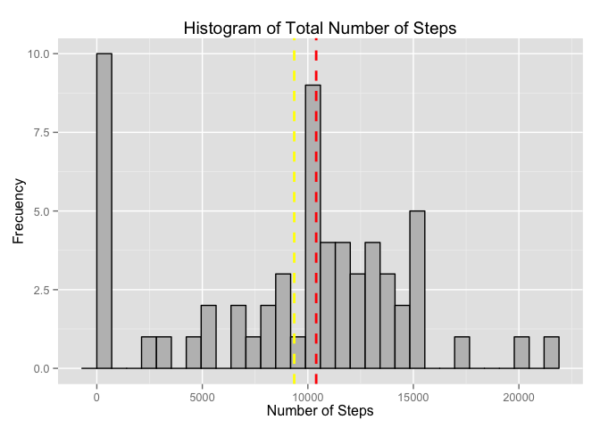
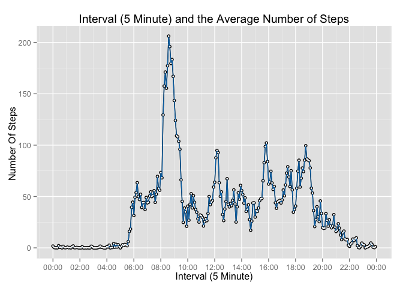
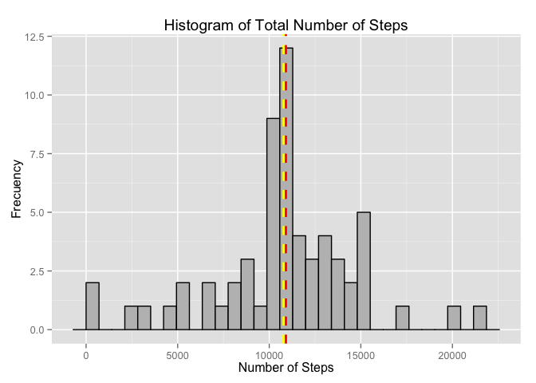
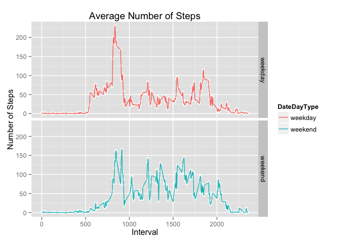

# Reproducible Research: Peer Assessment 1

## Introduction

It is now possible to collect a large amount of data about personal
movement using activity monitoring devices such as a
[Fitbit](http://www.fitbit.com), [Nike
Fuelband](http://www.nike.com/us/en_us/c/nikeplus-fuelband), or
[Jawbone Up](https://jawbone.com/up). These type of devices are part of
the "quantified self" movement -- a group of enthusiasts who take
measurements about themselves regularly to improve their health, to
find patterns in their behavior, or because they are tech geeks. But
these data remain under-utilized both because the raw data are hard to
obtain and there is a lack of statistical methods and software for
processing and interpreting the data.

This assignment makes use of data from a personal activity monitoring
device. This device collects data at 5 minute intervals through out the
day. The data consists of two months of data from an anonymous
individual collected during the months of October and November, 2012
and include the number of steps taken in 5 minute intervals each day.

## Data

The data for this assignment can be downloaded from the course web
site:

* Dataset: [Activity monitoring data](https://d396qusza40orc.cloudfront.net/repdata%2Fdata%2Factivity.zip) [52K]

The variables included in this dataset are:

* **steps**: Number of steps taking in a 5-minute interval (missing
    values are coded as `NA`)

* **date**: The date on which the measurement was taken in YYYY-MM-DD
    format

* **interval**: Identifier for the 5-minute interval in which
    measurement was taken


The dataset is stored in a comma-separated-value (CSV) file and there
are a total of 17,568 observations in this
dataset.

##Loading and preprocessing the data
1. Load the data (i.e. read.csv())

```r
#Setting working Directory
setwd("/Users/lucasube/Desktop/Projects/Coursera/Reproducible Research/")
if(!file.exists("./Peer Assessment 1")){dir.create("./Peer Assessment 1", showWarnings = TRUE, recursive = FALSE, mode = "0777")}
setwd("./Peer Assessment 1")
#Create a Data Directory if doesn't Exist
if(!file.exists("./Data")){dir.create("./Data")}

if(!file.exists("./Data/activity.zip")){
        fileURL <- "https://d396qusza40orc.cloudfront.net/repdata%2Fdata%2Factivity.zip";
        #Download a unzip the file
        download.file(fileURL, destfile = "./Data/activity.zip", method = "curl");
        unzip(zipfile="./Data/activity.zip",exdir="./Data");
}
ActivityData <- read.csv("./Data/activity.csv", header=TRUE, sep=",", na.strings = "NA")
head(ActivityData)
```

```
##   steps       date interval
## 1    NA 2012-10-01        0
## 2    NA 2012-10-01        5
## 3    NA 2012-10-01       10
## 4    NA 2012-10-01       15
## 5    NA 2012-10-01       20
## 6    NA 2012-10-01       25
```

```r
summary(ActivityData)
```

```
##      steps                date          interval     
##  Min.   :  0.00   2012-10-01:  288   Min.   :   0.0  
##  1st Qu.:  0.00   2012-10-02:  288   1st Qu.: 588.8  
##  Median :  0.00   2012-10-03:  288   Median :1177.5  
##  Mean   : 37.38   2012-10-04:  288   Mean   :1177.5  
##  3rd Qu.: 12.00   2012-10-05:  288   3rd Qu.:1766.2  
##  Max.   :806.00   2012-10-06:  288   Max.   :2355.0  
##  NA's   :2304     (Other)   :15840
```

```r
str(ActivityData)
```

```
## 'data.frame':	17568 obs. of  3 variables:
##  $ steps   : int  NA NA NA NA NA NA NA NA NA NA ...
##  $ date    : Factor w/ 61 levels "2012-10-01","2012-10-02",..: 1 1 1 1 1 1 1 1 1 1 ...
##  $ interval: int  0 5 10 15 20 25 30 35 40 45 ...
```

```r
#Load libraries
suppressMessages(library(dplyr))
suppressMessages(library(ggplot2))
suppressMessages(library(scales))
```

2. Process/transform the data (if necessary) into a format suitable for your analysis


## What is mean total number of steps taken per day?
######For this part of the assignment, you can ignore the missing values in the dataset.

1. Calculate the total number of steps taken per day

```r
TotalStepPerDay <- ActivityData %>% 
        group_by(date) %>% 
        summarise(Total = sum(steps, na.rm = T));
glimpse(TotalStepPerDay)
```

```
## Observations: 61
## Variables:
## $ date  (fctr) 2012-10-01, 2012-10-02, 2012-10-03, 2012-10-04, 2012-10...
## $ Total (int) 0, 126, 11352, 12116, 13294, 15420, 11015, 0, 12811, 990...
```

```r
summary(TotalStepPerDay)
```

```
##          date        Total      
##  2012-10-01: 1   Min.   :    0  
##  2012-10-02: 1   1st Qu.: 6778  
##  2012-10-03: 1   Median :10395  
##  2012-10-04: 1   Mean   : 9354  
##  2012-10-05: 1   3rd Qu.:12811  
##  2012-10-06: 1   Max.   :21194  
##  (Other)   :55
```

1.Make a histogram of the total number of steps taken each day


```r
gr <-   ggplot(TotalStepPerDay, aes(x=Total)) + 
        geom_histogram(colour="black", fill="grey") +
        geom_vline(aes(xintercept=mean(TotalStepPerDay$Total, na.rm=T)), color = "yellow", linetype = "dashed", size = 1) + 
        geom_vline(aes(xintercept=median(TotalStepPerDay$Total, na.rm=T)), color = "red", linetype = "dashed", size = 1) + 
        labs(title = "Histogram of Total Number of Steps",x = "Number of Steps", y = "Frecuency");
suppressMessages(print(gr))
```

 

2.Calculate and report the mean and median total number of steps taken per day

```r
#Mean of the total number of steps taken per day
StepsMean <- mean(TotalStepPerDay$Total)
#Median of the total number of steps taken per day
StepsMedian <- median(TotalStepPerDay$Total)
```
The mean and median of total number of steps taken per day are Mean **9354.2295082**, Median **10395** respectively.

## What is the average daily activity pattern?

1. Make a time series plot (i.e. `type = "l"`) of the 5-minute interval (x-axis) and the average number of steps taken, averaged across all days (y-axis)

```r
AvgIntervalStep <- ActivityData %>% 
        group_by(interval) %>% 
        summarise(AvgInterval = mean(steps, na.rm = T));

AvgIntervalStep$time <- as.POSIXct(with(AvgIntervalStep,paste(interval %/% 100, interval %% 100, sep=":")),format="%H:%M")
glimpse(AvgIntervalStep)
```

```
## Observations: 288
## Variables:
## $ interval    (int) 0, 5, 10, 15, 20, 25, 30, 35, 40, 45, 50, 55, 100,...
## $ AvgInterval (dbl) 1.7169811, 0.3396226, 0.1320755, 0.1509434, 0.0754...
## $ time        (time) 2015-04-18 00:00:00, 2015-04-18 00:05:00, 2015-04...
```

```r
gr <-   qplot(time, AvgInterval, data = AvgIntervalStep, geom = c("point", "line"))+ 
        geom_line(aes(group=1), colour="#0072B2") + 
        geom_point(size=1, colour="#FFFFFF")  +
        labs(title = "Interval (5 Minute) and the Average Number of Steps",x = "Interval (5 Minute)", y = "Number Of Steps ") +
        scale_x_datetime(breaks = date_breaks("2 hour"),labels = date_format("%H:%M"));
print(gr)        
```

 

2. Which 5-minute interval, on average across all the days in the dataset, contains the maximum number of steps?


The 5-minute interval, that contains the maximum number of steps is: Interval: [**835**] **08:35**
,Average: **206.1698113**

## Imputing missing values
Note that there are a number of days/intervals where there are missing
values (coded as `NA`). The presence of missing days may introduce
bias into some calculations or summaries of the data.

1. Calculate and report the total number of missing values in the dataset (i.e. the total number of rows with `NA`s)

```r
NATotal <- ActivityData %>% filter(is.na(steps)) %>%
        summarize(Total= n());
```
The total number of missing values (`NA's`) in the dataset are **2304**

2. Devise a strategy for filling in all of the missing values in the dataset. The strategy does not need to be sophisticated. For example, you could use the mean/median for that day, or the mean for that 5-minute interval, etc.

As a strategy for filling the missing values in the dataset, we used the round mean value of the specific 5-minute interval in which the observation is missing (`NA`).

```r
ActivityDataNASteps <- data.frame(ActivityData$steps);
ActivityDataNASteps[is.na(ActivityDataNASteps),] <- ceiling(tapply(X=ActivityData$steps,INDEX=ActivityData$interval,FUN=mean,na.rm=TRUE));
```


3. Create a new dataset that is equal to the original dataset but with the missing data filled in.

```r
NewActivityData <- cbind(ActivityDataNASteps, ActivityData[,2:3]);
colnames(NewActivityData) <- c("Steps", "Date", "Interval");
head(NewActivityData)
```

```
##   Steps       Date Interval
## 1     2 2012-10-01        0
## 2     1 2012-10-01        5
## 3     1 2012-10-01       10
## 4     1 2012-10-01       15
## 5     1 2012-10-01       20
## 6     3 2012-10-01       25
```


4. Make a histogram of the total number of steps taken each day and Calculate and report the **mean** and **median** total number of steps taken per day. Do these values differ from the estimates from the first part of the assignment? What is the impact of imputing missing data on the estimates of the total daily number of steps?

```r
TotalStepPerDay <- NewActivityData %>% 
        group_by(Date) %>% 
        summarise(Total = sum(Steps, na.rm = T));

glimpse(TotalStepPerDay);
```

```
## Observations: 61
## Variables:
## $ Date  (fctr) 2012-10-01, 2012-10-02, 2012-10-03, 2012-10-04, 2012-10...
## $ Total (dbl) 10909, 126, 11352, 12116, 13294, 15420, 11015, 10909, 12...
```

```r
summary(TotalStepPerDay);
```

```
##          Date        Total      
##  2012-10-01: 1   Min.   :   41  
##  2012-10-02: 1   1st Qu.: 9819  
##  2012-10-03: 1   Median :10909  
##  2012-10-04: 1   Mean   :10785  
##  2012-10-05: 1   3rd Qu.:12811  
##  2012-10-06: 1   Max.   :21194  
##  (Other)   :55
```

```r
gr <- ggplot(TotalStepPerDay, aes(x=Total)) + 
        geom_histogram(colour="black", fill="grey") +
        geom_vline(aes(xintercept=mean(TotalStepPerDay$Total, na.rm=T)), color = "yellow", linetype = "dashed", size = 1) + 
        geom_vline(aes(xintercept=median(TotalStepPerDay$Total, na.rm=T)), color = "red", linetype = "dashed", size = 1) + 
        labs(title = "Histogram of Total Number of Steps",x = "Number of Steps", y = "Frecuency");

suppressMessages(print(gr));
```

 


```r
#Mean of the total number of steps taken per day
NStepsMean <- mean(TotalStepPerDay$Total)
#Median of the total number of steps taken per day
NStepsMedian <- median(TotalStepPerDay$Total)
```

The mean and median of total number of steps taken per day (after imputing the missing values) are Mean **10784.92**, 
Median **10909.00** respectively.


```r
#Percentage of variation of the Mean
DMean <- (StepsMean-NStepsMean)/StepsMean
DMean <- paste(round(100*DMean, 2), "%")
#Percentage of variation of the mean
DMedian <- (StepsMedian-NStepsMedian)/StepsMedian
DMedian <- paste(round(100*DMedian, 2), "%")
```

After imputing the missing values, the variation of the mean is **-15.29 %** and the median **-4.94 %**, according to the defined strategy.


## Are there differences in activity patterns between weekdays and weekends?
For this part the `weekdays()` function may be of some help here. Use
the dataset with the filled-in missing values for this part.

1. Create a new factor variable in the dataset with two levels -- "weekday" and "weekend" indicating whether a given date is a weekday or weekend day.

```r
DateDayType <- weekdays(as.Date(NewActivityData$Date))
NewActivityData$DateDayType <- sapply(DateDayType, function(Day) {
        if (Day %in% c("Saturday", "Sunday")) {
                return("weekend")
        } else {
                return("weekday")
        }
});
NewActivityData$DateDayType<-as.factor(NewActivityData$DateDayType)
class(NewActivityData$DateDayType)
```

```
## [1] "factor"
```

```r
head(NewActivityData)
```

```
##   Steps       Date Interval DateDayType
## 1     2 2012-10-01        0     weekday
## 2     1 2012-10-01        5     weekday
## 3     1 2012-10-01       10     weekday
## 4     1 2012-10-01       15     weekday
## 5     1 2012-10-01       20     weekday
## 6     3 2012-10-01       25     weekday
```

2. Make a panel plot containing a time series plot (i.e. `type = "l"`) of the 5-minute interval (x-axis) and the average number of steps taken, averaged across all weekday days or weekend days (y-axis). The plot should look something like the following, which was created using **simulated data**:

```r
#Load library
suppressMessages(library(reshape))

DayTypeIntervalSteps <-NewActivityData %>% 
        group_by(DateDayType,Interval) %>% 
        summarise(Steps = mean(Steps));

gr <- ggplot(data = DayTypeIntervalSteps,aes(x=Interval, y=Steps, colour=DateDayType)) +
        geom_point(size=2, colour="#FCFCFC")  +
        labs(title = "Average Number of Steps",x = "Interval", y = "Number of Steps") +
        geom_line() + facet_grid(DateDayType ~ .);
print(gr);
```

 


```r
TTypeInterval <- DayTypeIntervalSteps %>%
        group_by(DateDayType) %>% 
        summarise(Steps = ceiling(sum(Steps)));   
TTypeInterval
```

```
## Source: local data frame [2 x 2]
## 
##   DateDayType Steps
## 1     weekday 10275
## 2     weekend 12220
```

There is a more activity during Weekend time.
